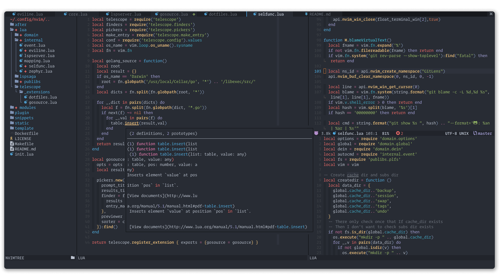

<h1 align="center">
  
  Neovim Config
  
</h1>

  
  
  

  

## 💭 About

My personal neovim configuration written in lua.

## 🧩 Requires

- Neovim Nightly

- [🌈 lolcat](https://github.com/busyloop/lolcat)

## 🎁 Features

- Fastest startup time in 20-35ms with 40 plugins.
- ...

&nbsp;

  

  Copyright &copy; 2020-present
  <a href="https://github.com/glepnir" target="_blank">Raphael</a>

  

